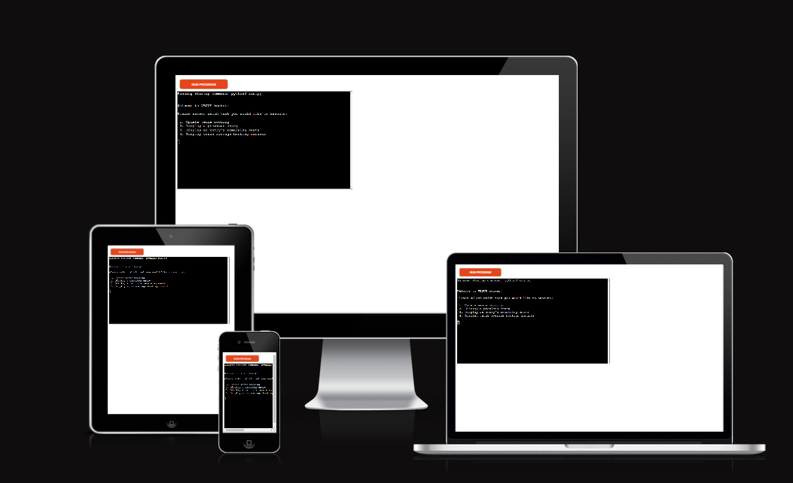

## Reminders

* Your code must be placed in the `run.py` file
* Your dependencies must be placed in the `requirements.txt` file
* Do not edit any of the other files or your code may not deploy properly

## Creating the Heroku app

When you create the app, you will need to add two buildpacks from the _Settings_ tab. The ordering is as follows:

1. `heroku/python`
2. `heroku/nodejs`

You must then create a _Config Var_ called `PORT`. Set this to `8000`

If you have credentials, such as in the Love Sandwiches project, you must create another _Config Var_ called `CREDS` and paste the JSON into the value field.

Connect your GitHub repository and deploy as normal.
------------------------------------------------------------------------------------------------------------------------------------------------------------------------
# VENUE Booker

VENUE-Booker is a command-line data-management application, which runs via the code institute mock terminal on Heroku. Users can input, sort, replace and view common datasets in the form of venue seat booking amounts, stored and updated externally via a google spreadsheet.

## [Live Website Link (GitHub Pages)](liam-wb.github.io/quizology/)
---

# Directory

- [VENUE-Booker](#VENUE_Booker)

## How to use
---

Common in most business data sorting tools, the user is greeted by the option to manage or view current data. The user is first given the option between adding to the current database and updating the seat bookings for each venue, or displaying a current dataset instead. 

If the user decides to add to the current data, this will automatically update the data file and automatically calculate and update the remaining seats for each venue from the data added. If the user decides to display data instead, they are able to pick between viewing either a set of previously input venue bookings, or the corresponding set of data for the seats that remained available for that data submission. 

Furthermore, the user is given the option to view a the previous booking, multiple bookings, all bookings, or the specific one the user inputs. Lastly, the user is given the option to check each venue's current average bookings as with business would require a way to see trends and changes in popularity. Unless the user types exit after a task, the user will be given the option to return to the initial task selection, and all data input is validated to ensure a smooth process and efficiency in the functions.